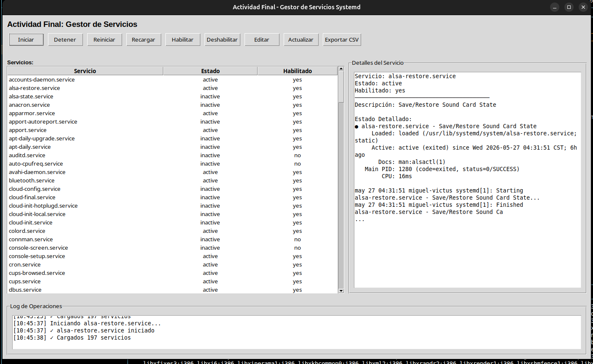
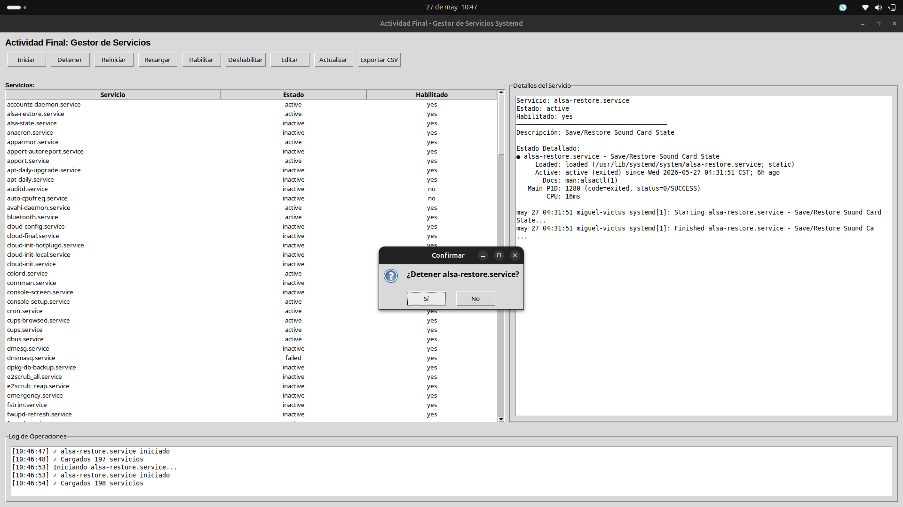
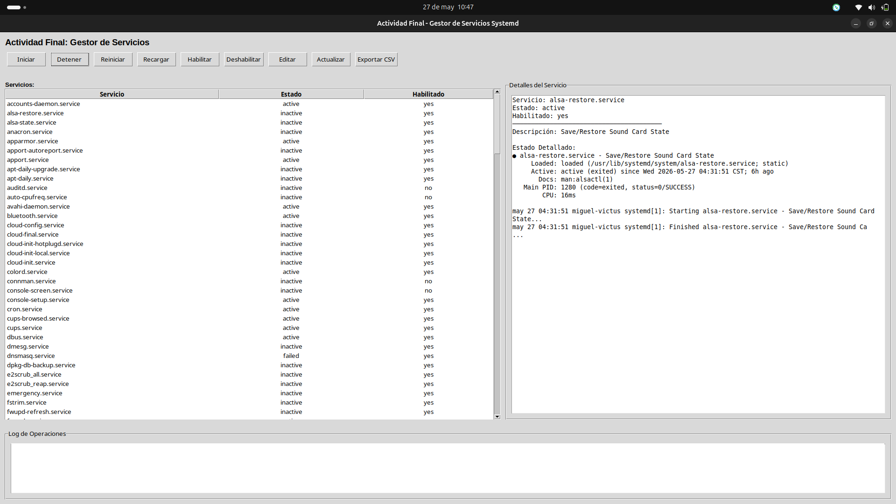
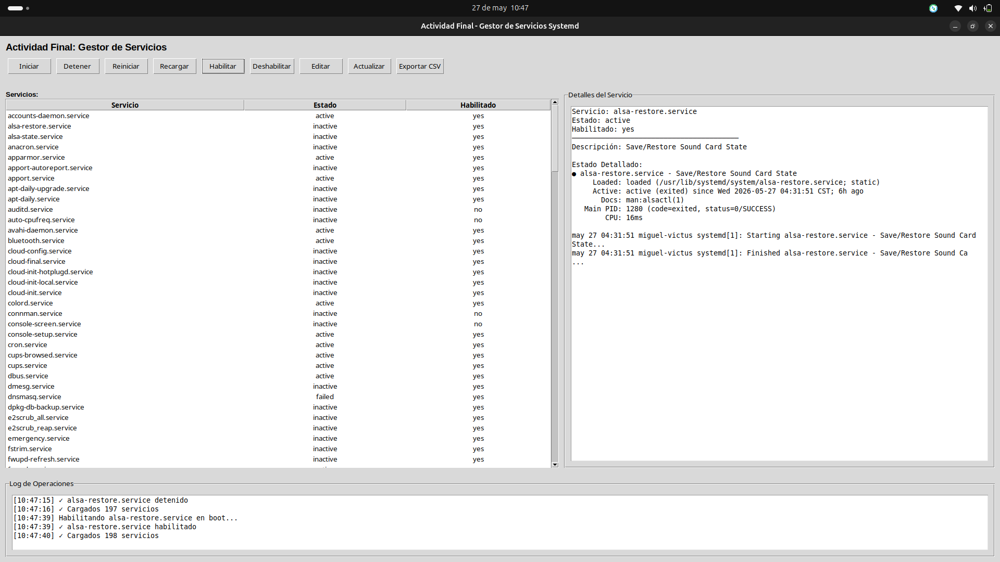

# Actividad Final: Gestor de Servicios (Debian/Ubuntu)

**Alumno :** José Miguel Martínez Martínez 

**Fecha:** 27 de mayo de 2026

---

## Portada

**Título:** Interfaz gráfica para gestión de servicios systemd

**Resumen:** Aplicación en Python y `tkinter` para listar y gestionar servicios `systemd` en Debian/Ubuntu. Incluye edición segura de archivos `.service` que maneja particiones montadas en `ro` mediante remount temporal y generación de reportes.

---

## Contenido

1. Resumen
2. Requisitos
3. Instalación y ejecución
4. Uso y ejemplos
5. Explicación del programa
6. Pruebas (corridas)
7. Conclusión
8. Anexos (logs y archivos generados)

---

## 1. Resumen

Esta actividad entrega una aplicación con interfaz gráfica que permite a un administrador listar servicios, ver detalles, iniciar/detener/reiniciar/recargar, habilitar/deshabilitar en boot y editar el archivo de unidad si es necesario. Además exporta la lista actual a CSV.

## 2. Requisitos

- Sistema: Debian/Ubuntu con systemd
- Python 3.6+
- tkinter
- Permisos: `sudo` para operaciones privilegiadas


## 4. Uso y ejemplos

- Seleccione un servicio y presione `Detener` para parar el servicio.
- Seleccione `Editar`, modifique el archivo `.service` y presione `Guardar`.
- Si el archivo reside en una partición con `ro`, el programa intentará `remount,rw`, copiar el archivo y restaurar `ro`.
- Use `Exportar CSV` para generar `services_report.csv`.

## 5. Explicación del programa

- Interfaz: `tkinter` con `ttk.Treeview` para listar servicios.
- Lógica de servicios: `systemctl` para listar y gestionar; `systemctl show -p FragmentPath` para localizar el archivo de unidad.
- Edición segura: escribe en un temporal y copia con `sudo` al destino; usa `findmnt` y `mount -o remount` para cambiar opciones del punto de montaje si está en `ro`.
- Logging: `services_manager.log` registra acciones y errores.

## 6. Pruebas (corridas)

A continuación ejemplos de comandos o acciones realizadas durante pruebas.

- Ejemplo: detener `cron`

1. Seleccionar `cron.service` en la lista.
2. Pulsar `Detener` y confirmar.
3. Ver en el log:

```
[14:30:10] Deteniendo cron.service...
[14:30:10] ✓ cron.service detenido
```

- Ejemplo: editar archivo de unidad

1. Seleccionar servicio con archivo en `/lib/systemd/system/ejemplo.service`.
2. Pulsar `Editar`, cambiar la descripción y `Guardar`.
3. Ver en el log:

```
[14:35:02] ✓ Archivo /lib/systemd/system/ejemplo.service guardado
```

## 7. Conclusión

La aplicación cumple los requisitos de la actividad final: proporciona una interfaz para gestionar servicios, incluye operaciones de administración y un mecanismo para editar archivos de unidad con cuidado en particiones de solo-lectura. Se recomienda revisar los permisos `sudo` y realizar backups antes de editar unidades críticas.

## 8. Anexos

- `services_manager.log` (archivo de log generado por la aplicación)
- `services_report.csv` (cuando se exporta la lista)

## Imágenes de la ejecución

A continuación se muestran las capturas de la aplicación en ejecución.

**01** — Ventana principal con lista de servicios y panel de detalles.



**02** — Vista ampliada con el log y detalle del servicio seleccionado.


**03** — Confirmación para detener un servicio.



**04** — Servicio detenido y log actualizado.



**05** — Confirmación para deshabilitar el servicio en boot.



**06** — Servicio deshabilitado en boot y log actualizado.


**07** — Botones de edición y exportación en la interfaz.


---

