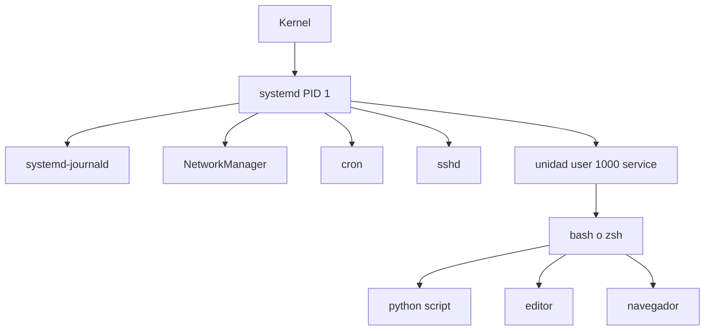

# 17. (Adicional) Diagrama de Procesos de Debian

**Fechas:** 13 de mayo de 2026 - 20 de mayo de 2026

---

## 1. Introducción

En Debian, la gestión de procesos describe como el sistema operativo crea, organiza, prioriza y finaliza tareas desde el arranque hasta el apagado. El diagrama de procesos permite entender la jerarquía entre procesos, su relación padre-hijo y la forma en que comparten CPU, memoria y recursos de entrada/salida.

El objetivo de esta actividad es resumir ese diagrama y ampliarlo con documentación técnica adicional, incorporando apoyo de IA para mejorar claridad y análisis.

---

## 2. Resumen del Diagrama de Procesos de Debian

### 2.1 Proceso raíz del sistema

- El primer proceso en Debian moderno es `systemd` (PID 1).
- `systemd` inicializa servicios, monta sistemas de archivos, administra dependencias y controla unidades del sistema.
- Todos los procesos en espacio de usuario descienden, directa o indirectamente, de PID 1.

### 2.2 Jerarquía principal

- **Kernel threads**: hilos internos del kernel, visibles en herramientas de monitoreo con nombres entre corchetes, por ejemplo `[kthreadd]`.
- **Servicios del sistema**: demonios como `cron`, `dbus-daemon`, `NetworkManager`, `sshd`, `systemd-journald`.
- **Sesión de usuario**: al iniciar sesión se crean procesos de shell y aplicaciones (`bash`, `zsh`, `python`, navegadores, editores).

### 2.3 Estados típicos de procesos

Un proceso en Debian suele pasar por estados clásicos:

- `R` Running: en ejecución o listo para ejecutar.
- `S` Sleeping: esperando evento (estado más común).
- `D` Uninterruptible sleep: espera de I/O no interrumpible.
- `T` Stopped: detenido por señal o depuración.
- `Z` Zombie: finalizado, pendiente de recolección por el padre.

### 2.4 Relaciones padre-hijo

- Cada proceso tiene `PID` e `PPID`.
- Si un padre termina antes que el hijo, el proceso huérfano es adoptado por `systemd`.
- Si un padre no hace `wait()` sobre un hijo terminado, puede aparecer un proceso zombie.

---

## 3. Diagrama Conceptual

Interpretacion:

- El kernel inicia `systemd`.
- `systemd` controla servicios del sistema.
- La sesión de usuario cuelga de una unidad de usuario y desde ahí nacen aplicaciones interactivas.

---

## 4. Ampliación con documentación técnica

### 4.1 Manuales y páginas oficiales

1. **man 1 ps / man 1 top / man 1 pstree**

   - Permiten observar procesos activos, consumo de recursos y estructura jerárquica.
2. **man 5 proc**

   - Describe `/proc`, pseudo-sistema de archivos con metadatos de procesos (estado, memoria, CPU, descriptores).
3. **systemd documentation**

   - Explica unidades (`.service`, `.target`, `.socket`) y dependencias de arranque.
4. **Debian Administrator's Handbook**

   - Proporciona enfoque práctico de administración de servicios y troubleshooting.

### 4.2 Herramientas recomendadas para validar el diagrama

- `pstree -p` para mostrar arbol de procesos con PID.
- `ps -ef --forest` para vista jerarquica en texto.
- `top` o `htop` para monitoreo en tiempo real.
- `systemd-cgls` para ver procesos por cgroups.
- `journalctl` para rastrear eventos y fallos de servicios.

### 4.3 Relación con cgroups y control de recursos

En Debian con systemd, los procesos se agrupan en cgroups para controlar:

- CPU
- Memoria
- I/O
- Número de tareas

Esto permite aislamiento y mejor administración de cargas, especialmente en servidores multiusuario.

---

## 5. Aporte de IA en la explicación

La IA puede apoyar esta actividad en tres niveles:

1. **Síntesis técnica**

   - Convertir documentación extensa en resúmenes claros por capas (kernel, systemd, usuario).
2. **Detección de patrones**

   - Identificar cadenas de procesos inusuales, crecimiento anómalo de hijos o estados zombies repetidos.
3. **Asistencia para reporte**

   - Estructurar hallazgos en formato académico, mantener consistencia y mejorar trazabilidad de conclusiones.

Importante: la IA no reemplaza la verificación técnica. Los datos deben confirmarse con comandos del sistema y documentación oficial.

---

## 6. Análisis práctico del diagrama

- Debian centraliza la orquestacion de procesos de usuario en `systemd`.
- El arbol de procesos permite ubicar rapidamente origen de consumo de recursos.
- Servicios en fallo suelen detectarse por cambios de estado y reinicios en cascada.
- La combinacion de `ps`, `pstree`, `journalctl` y cgroups ofrece una vista completa: estructura, estado, eventos y limites.

---

## 7. Conclusiones

1. El diagrama de procesos de Debian se entiende mejor al separar tres niveles: kernel, servicios del sistema y sesión de usuario.
2. `systemd` como PID 1 es pieza clave para explicar jerarquía, control y recuperación de servicios.
3. El uso de documentación oficial y herramientas de inspección en vivo valida el modelo teórico.
4. La IA aporta valor para resumir, ordenar y detectar patrones, siempre complementada con evidencia del sistema real.

---

## 8. Bibliografía

1. Debian Administrator's Handbook. https://debian-handbook.info/
2. systemd Documentation. https://www.freedesktop.org/wiki/Software/systemd/
3. Linux man-pages project (`ps`, `proc`, `top`, `pstree`). https://man7.org/linux/man-pages/
4. The Linux Programming Interface, Michael Kerrisk.
