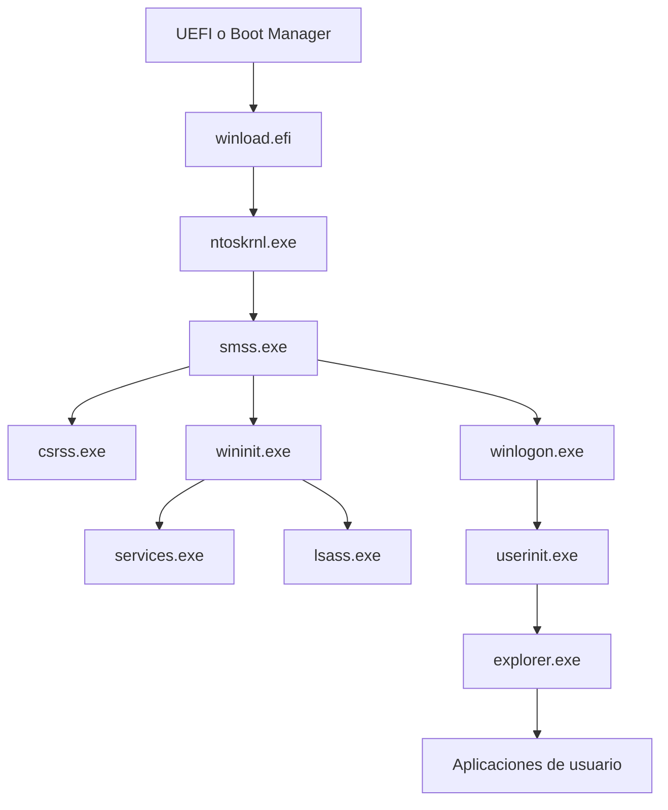

# Diagrama de Procesos de Windows 11

**Fechas:** 20 de mayo de 2026 - 27 de mayo de 2026
**Alumno:** José Miguel Martínez Martínez
---

## 1. Introducción

Windows 11 administra miles de procesos en diferentes capas: kernel, servicios del sistema, sesión de usuario y aplicaciones. El diagrama de procesos ayuda a comprender como inicia el sistema, que componentes son críticos y como se relacionan los procesos padre-hijo.

Esta actividad resume ese diagrama y amplifica la explicación con documentación técnica adicional y apoyo de IA para mejorar el análisis.

---

## 2. Resumen del Diagrama de Procesos de Windows 11

### 2.1 Secuencia base de arranque

1. **UEFI/Boot Manager** carga el cargador del sistema.
2. **winload.efi** inicia el kernel (`ntoskrnl.exe`) y componentes esenciales.
3. El kernel arranca `smss.exe` (Session Manager Subsystem).
4. `smss.exe` crea procesos clave de entorno de usuario y sesion.

### 2.2 Procesos nucleares del sistema

- `System` (PID 4): proceso especial asociado al kernel.
- `smss.exe`: inicializa sesiones y procesos de arranque en modo usuario.
- `csrss.exe`: Client/Server Runtime Subsystem para cada sesion.
- `wininit.exe`: inicia servicios criticos del sistema en sesion 0.
- `services.exe`: Service Control Manager (SCM), arranca y controla servicios.
- `lsass.exe`: Local Security Authority, autenticacion y politicas de seguridad.

### 2.3 Sesion de usuario interactiva

- `winlogon.exe`: gestiona inicio de sesion interactivo.
- `userinit.exe`: prepara entorno del usuario.
- `explorer.exe`: shell grafica principal (escritorio, barra de tareas, explorador).
- A partir de `explorer.exe` suelen lanzarse apps de usuario (navegador, editor, terminal, etc.).

### 2.4 Tipos de estado y comportamiento

En Windows, los hilos y procesos alternan entre:

- **Running**: ejecutandose en CPU.
- **Ready**: listos para ejecutarse.
- **Waiting/Blocked**: esperando I/O, eventos o sincronizacion.
- **Terminated**: proceso finalizado.

Tambien puede distinguirse entre procesos en primer plano, en segundo plano, suspendidos y procesos protegidos del sistema.

---

## 3. Diagrama Conceptual

Interpretacion:

- El flujo pasa de firmware a kernel y luego a subsistemas de usuario.
- `smss.exe` y `wininit.exe` son pivotes del arranque en modo usuario.
- `services.exe` y `lsass.exe` sostienen disponibilidad y seguridad.
- La experiencia interactiva inicia con `winlogon.exe` y termina en `explorer.exe`.

---

## 4. Ampliacion con Documentacion Tecnica

### 4.1 Fuentes recomendadas

1. **Microsoft Learn - Windows Internals (overview)**

   - Arquitectura de kernel, scheduler, memoria y modelo de procesos/hilos.
2. **Windows Sysinternals Documentation**

   - Herramientas como Process Explorer, Autoruns y Procmon para validar el diagrama real.
3. **Windows Internals (Russinovich et al.)**

   - Referencia profunda sobre Session Manager, SCM, seguridad y objetos del sistema.
4. **Microsoft Learn - Service Control Manager**

   - Ciclo de vida de servicios, dependencias y modos de arranque.

### 4.2 Herramientas practicas para verificar el diagrama

- **Task Manager**: vista general de procesos, consumo y jerarquias basicas.
- **Process Explorer (Sysinternals)**: arbol de procesos detallado, firmas, handles, parent PID.
- **Process Monitor**: eventos de procesos, registro, sistema de archivos y red.
- **Event Viewer**: eventos de inicio, errores de servicio y auditoria.
- **PowerShell** (`Get-Process`, `Get-CimInstance Win32_Process`): evidencia reproducible en texto.

### 4.3 Seguridad y aislamiento

Windows 11 agrega mecanismos que impactan el modelo de procesos:

- **VBS** (Virtualization-Based Security).
- **Credential Guard** y proteccion de credenciales.
- **PPL** (Protected Process Light) para componentes sensibles.
- Aislamiento por integridad y politicas de control de aplicaciones.

Estos controles dificultan manipulacion de procesos criticos por software no autorizado.

---

## 5. Aporte de IA en la Explicacion

La IA puede aportar valor en:

1. **Sintesis por capas**

   - Separar explicaciones en boot, kernel, servicios, sesion y aplicaciones.
2. **Correlacion de evidencia**

   - Relacionar salidas de Process Explorer, Event Viewer y PowerShell.
3. **Deteccion de anomalias**

   - Sugerir patrones sospechosos: procesos hijos inusuales, rutas no firmadas, reinicios constantes.
4. **Soporte de reporte**

   - Estructurar resultados tecnicos de forma clara y academica.

Limitacion importante: la IA no reemplaza evidencia forense ni validacion manual; debe usarse como apoyo, no como unica fuente.

---

## 6. Análisis Práctico

- El árbol de procesos de Windows 11 tiene nodos críticos (`smss.exe`, `wininit.exe`, `services.exe`, `lsass.exe`) que explican estabilidad y seguridad.
- El diagnóstico de incidentes mejora al trazar parent-child y tiempos de creación de procesos.
- Process Explorer + logs del sistema + comandos de PowerShell forman una cadena de evidencia consistente.
- La documentación oficial confirma que el comportamiento observado depende de versión, políticas de seguridad y software instalado.

---

## 7. Conclusiones

1. El diagrama de procesos de Windows 11 se comprende mejor al estudiar fases de arranque y transición a sesión de usuario.
2. Los procesos de seguridad y control de servicios son fundamentales para disponibilidad y protección del sistema.
3. La validación con herramientas nativas y Sysinternals es esencial para pasar de teoría a evidencia técnica.
4. La IA acelera el análisis y redacción, pero la verificación final debe basarse en datos reales del sistema.

---

## 8. Bibliografía

1. Microsoft Learn. Windows architecture and internals. https://learn.microsoft.com/
2. Sysinternals Documentation. https://learn.microsoft.com/sysinternals/
3. Windows Internals, Part 1 and Part 2 (7th Edition), Mark Russinovich, David Solomon, Alex Ionescu.
4. Microsoft Learn. Service Control Manager documentation. https://learn.microsoft.com/windows/win32/services/
