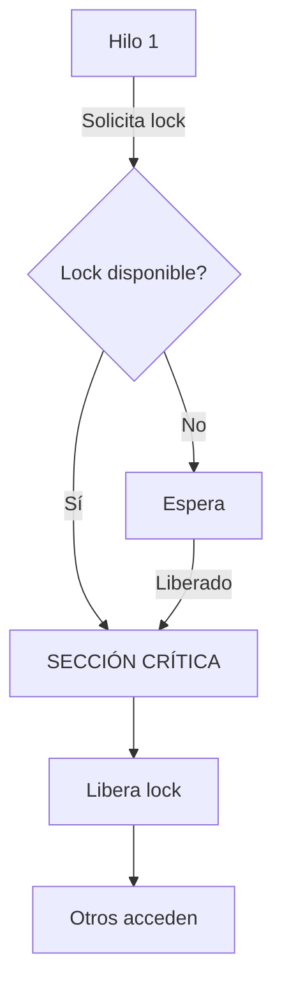

# Tarea 13: Primitivas de Sincronización de Procesos

**Fechas:** 29 de abril de 2026 - 4 de mayo de 2026

---

## Descripción

Implementar ejemplos de todas las primitivas de sincronización en Python, demostrando áreas críticas y evitando condiciones de carrera.

---

## Primitivas a Implementar

### 1. Mutex (Lock)
- Bloquea/desbloquea acceso a recurso
- Una sola entidad a la vez
- Ejemplo: contador compartido

### 2. Semáforo
- Contador de recursos disponibles
- Múltiples entidades pueden acceder
- Ejemplo: pool de conexiones

### 3. Semáforo Binario
- Similar a Mutex (contador=1)
- Ejemplo: alternancia entre procesos

### 4. Condition Variable
- Sincronización basada en condiciones
- Espera/notifica eventos
- Ejemplo: productor-consumidor

### 5. Barrera
- Sincroniza múltiples hilos en punto
- Todos esperan a todos
- Ejemplo: inicio simultáneo

### 6. Reader-Writer Lock
- Múltiples lectores O un escritor
- Ejemplo: caché compartida

**Excepción:** No implementar BoundedSemaphore

---

## Requisitos de Implementación

### Formato Simple:
- Usar prints para identificar áreas críticas
- Mostrar claramente: entrada, sección crítica, salida
- Pausas (sleep) para visualizar flujo

### Ejemplo Básico:
```python
import threading
import time

counter = 0
lock = threading.Lock()

def increment():
    global counter
    print("[ENTRADA] Hilo intentando acceder")
    with lock:  # SECCIÓN CRÍTICA
        print("[CRÍTICA] Leyendo contador:", counter)
        temp = counter
        time.sleep(0.1)  # Simular operación
        temp += 1
        counter = temp
        print("[CRÍTICA] Escribiendo:", counter)
    print("[SALIDA] Hilo liberó recurso")
```

---

## Primitivas Detalladas

### 1. Mutex - Lock
```python
import threading

# Variables compartidas
recurso = []
lock = threading.Lock()

def acceder_recurso():
    print("→ Esperando acceso...")
    with lock:
        print("✓ SECCIÓN CRÍTICA: Accediendo")
        recurso.append(1)
        print(f"  Recurso: {recurso}")
    print("← Liberado acceso")
```

### 2. Semáforo
```python
import threading

semaphore = threading.Semaphore(2)  # 2 recursos

def acceder_recurso_limitado():
    print("→ Solicitando recurso...")
    semaphore.acquire()
    print("✓ SECCIÓN CRÍTICA: Usando recurso")
    semaphore.release()
    print("← Liberado")
```

### 3. Condition Variable
```python
import threading

condition = threading.Condition()
dato = None

def productor():
    global dato
    print("[PRODUCTOR] Generando dato...")
    with condition:
        dato = 42
        print("[PRODUCTOR] ✓ Notificando consumidores")
        condition.notify_all()

def consumidor():
    with condition:
        print("[CONSUMIDOR] Esperando dato...")
        condition.wait()
        print(f"[CONSUMIDOR] ✓ Dato recibido: {dato}")
```

### 4. Barrera
```python
import threading

barrier = threading.Barrier(3)

def hilo_sincrono(id):
    print(f"[Hilo {id}] Esperando en barrera...")
    barrier.wait()
    print(f"[Hilo {id}] ✓ Todos llegaron! Continuando...")
```

---

## Diagrama de Flujo (Mermaid)

Cada primitiva debe incluir diagrama tipo:



---

## Programa Principal

Crear un programa que:
1. Tenga un menú de opciones
2. Permita elegir qué primitiva demostrar
3. Cree múltiples hilos
4. Muestre el flujo con prints
5. Evite condiciones de carrera

```python
if __name__ == "__main__":
    print("=== Primitivas de Sincronización ===")
    print("1. Mutex (Lock)")
    print("2. Semáforo")
    print("3. Condition Variable")
    print("4. Barrera")
    print("5. Reader-Writer")
    opcion = input("Selecciona: ")
    
    if opcion == "1":
        demo_mutex()
    elif opcion == "2":
        demo_semaphore()
    # ... etc
```

---

## Formato de Salida Esperada

```
=== DEMO: Mutex (Lock) ===

[Hilo 1] → Esperando acceso
[Hilo 2] → Esperando acceso
[Hilo 1] ✓ SECCIÓN CRÍTICA (inicio)
[Hilo 1]   Operación 1
[Hilo 1]   Operación 2
[Hilo 1] ✓ SECCIÓN CRÍTICA (fin)
[Hilo 1] ← Liberado
[Hilo 2] ✓ SECCIÓN CRÍTICA (inicio)
[Hilo 2]   Operación 1
[Hilo 2]   Operación 2
[Hilo 2] ✓ SECCIÓN CRÍTICA (fin)
[Hilo 2] ← Liberado
```

---

## Archivos Relacionados

- `controlZC.py`: Archivo de control de zonas críticas
- `hilos.md`: Documentación sobre threading

---

## Evaluación

- [ ] Todas las primitivas implementadas (excepto BoundedSemaphore)
- [ ] Prints claros de secciones críticas
- [ ] Sin condiciones de carrera
- [ ] Diagramas Mermaid incluidos
- [ ] Código comentado
- [ ] Ejemplos funcionales
- [ ] Documentación clara

